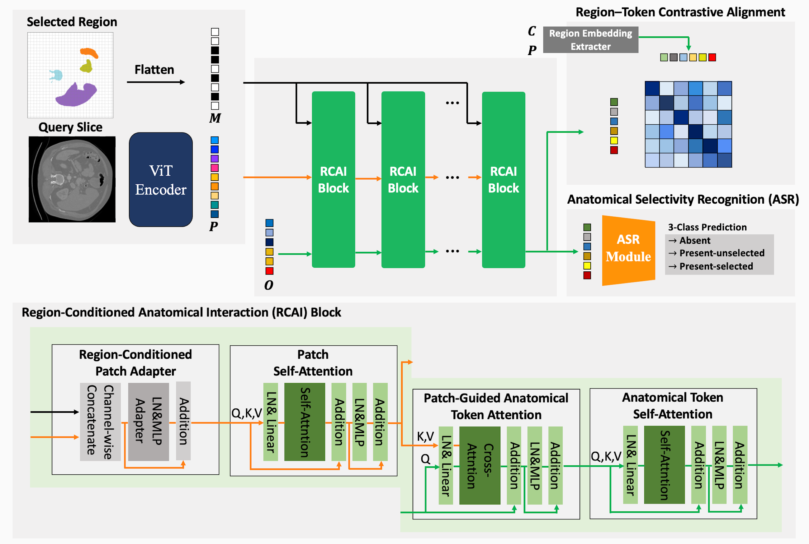
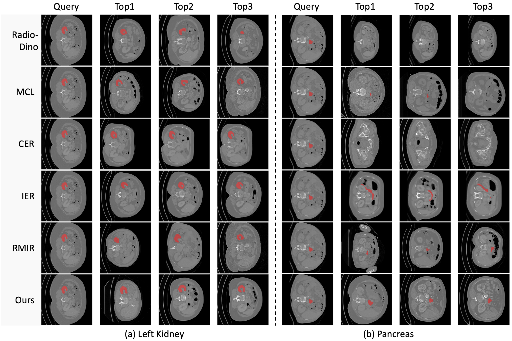

# RCAT:Region-Conditioned Anatomical Tokens for CT Image Retrieval


## Abstract
Content-based medical image retrieval (CBMIR) commonly represents each image using a fixed global embedding, limiting its ability to reflect visual similarity within a user-specified region. Existing region-based medical image retrieval (RBMIR) approaches construct region-specific representations but generally require predefined region extraction from database images, resulting in dependence on region annotations or external segmentation models. We propose the Region-Conditioned Anatomical Token Representation Framework (RCAT) for flexible region-based retrieval of computed tomography (CT) slices. RCAT represents each slice using anatomically structured tokens and learns region-conditioned representations through Region-Conditioned Anatomical Interaction, Region--Token Contrastive Alignment, and Anatomical Selectivity Recognition, which respectively incorporate region information, preserve anatomical visual characteristics, and identify query-relevant tokens. Database tokens are precomputed once using the full image as the region condition, while query-derived selectivity weights determine their contribution during retrieval. This enables region-conditioned retrieval without region annotations or external segmentation during database construction. On TotalSegmentator, RCAT achieved a P@1 of 0.9366 and an mAP@10 of 0.9045, together with the best regional structural and perceptual similarity among the evaluated methods. On the unseen CT-ORG dataset, RCAT achieved a P@1 of 0.9406 and an mAP@10 of 0.9186 despite differences in anatomical region definitions. On the Medical Segmentation Decathlon, directly selecting tumor regions not predefined during training increased mAP@10 by 0.0460, whereas the evaluated region-level baselines showed decreased performance. RCAT further supports multi-region and user-specified spatial queries while retaining fixed database representations.


This package contains the cleaned RCAT pipeline aligned with the final paper terminology:

- **RCAI**: Region-Conditioned Anatomical Interaction
- **RTCA**: Region-Token Contrastive Alignment
- **ASR**: Anatomical Selectivity Recognition
- **ASR-CF**: optional ASR-based candidate filtering

## Results


## 1. Train RCAT

```bash
python scripts/B1.BuildModel.py \
  --config config/Model-Totalseg-RCAT.yaml
```

Resume a refactored RCAT training checkpoint:

```bash
python scripts/B1.BuildModel.py \
  --config config/Model-Totalseg-RCAT.yaml \
  --resume_checkpoint logs/<project>/<run>/last.ckpt
```

The debug-only 200-slice validation subsampling has been removed.

## 2. Build the database

```bash
python scripts/C1.BuildModelDatabase.py \
  --config config/Model-Totalseg-RCAT.yaml \
  --checkpoint logs/<project>/<run>/last.ckpt
```

Database construction uses **CT images only**. No segmentation is loaded. RCAI receives a full-image region condition.

Outputs:

- `slice_tokens.npy`: `[N, 117, 512]`
- `slice_asr_probs.npy`: `[N, 117, 3]`
- `slice_keys.json`
- `database_metadata.json`

The inference loader can also read the final legacy checkpoint and map the old module names to the refactored RCAT names without changing tensor values.

## 3. Extract query representations

Single-region queries, 50 per anatomical region:

```bash
python scripts/C2.ExtractQueryEmbeddings.py \
  --config config/Model-Totalseg-RCAT.yaml \
  --checkpoint logs/<project>/<run>/last.ckpt \
  --mode one \
  --n_regions 1 \
  --n_samples 50 \
  --sampling_seed 777
```

Multi-region queries:

```bash
python scripts/C2.ExtractQueryEmbeddings.py \
  --config config/Model-Totalseg-RCAT.yaml \
  --checkpoint logs/<project>/<run>/last.ckpt \
  --mode multi \
  --n_regions 2 \
  --n_queries 1000 \
  --sampling_seed 777
```

Each query stores:

- `query_idx`
- `anatomical_tokens`
- `selectivity_weights` = ASR `p(class=2)`
- `asr_probs`

Repeated multi-region draws no longer overwrite one another; every sampled query receives a unique `__qXXXXX` suffix.

## 4. Retrieval and evaluation

Base RCAT:

```bash
python scripts/C3.Retrieval.py \
  --config config/Model-Totalseg-RCAT.yaml \
  --mode one \
  --n_regions 1 \
  --n_samples 50
```

RCAT + ASR-CF with the paper thresholds:

```bash
python scripts/C3.Retrieval.py \
  --config config/Model-Totalseg-RCAT.yaml \
  --mode one \
  --n_regions 1 \
  --n_samples 50 \
  --asr_cf \
  --query_threshold 0.1 \
  --database_threshold 0.9
```

All available quality metrics:

```bash
python scripts/C3.Retrieval.py \
  --config config/Model-Totalseg-RCAT.yaml \
  --mode one \
  --n_regions 1 \
  --quality_metrics all
```

Available quality metrics are:

- `RelSizeSim`
- `RelLocSim`
- `RelLocDist`
- `BBoxIoU`
- `LPIPS`
- `SSIM`
- `MAE`
- `Wasserstein`

Ranking evaluation retains `Hit@K`, `P@K`, `Recall@K`, `AP@K`, `P@R`, and `QualityPositiveN@K`.

For paper-facing output, `SSIM@K` and `LPIPS@K` are additionally exposed as `SSIM_rel@K` and `LPIPS_rel@K`, while the original columns are retained.
